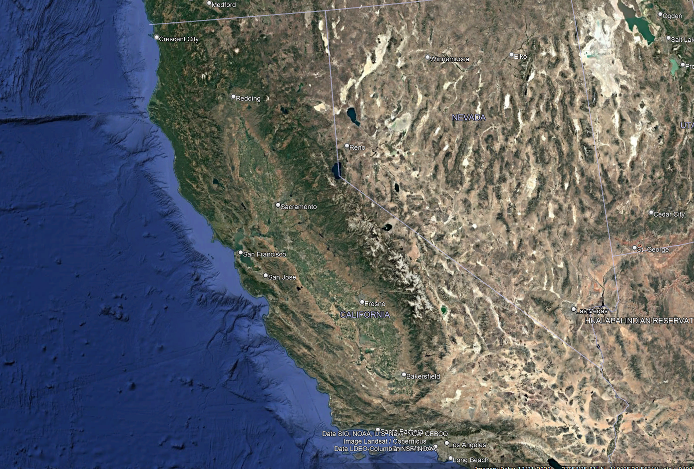
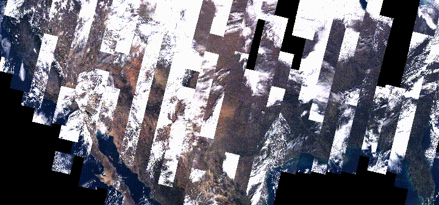

::: {.journey-page}

::: {.journey-hero}

{.journey-hero-image}

:::

---

::: {.journey-story}

（To be continued. This story is still being written. Please check back later for updates.）

{.journey-figure}

:::

:::

