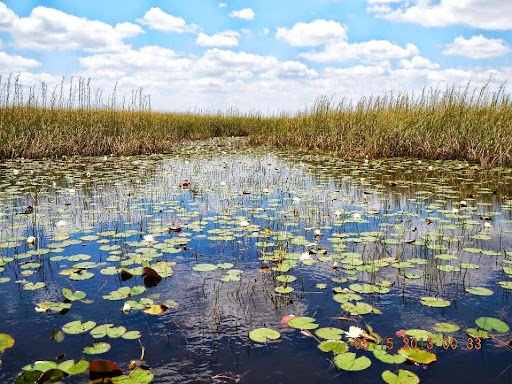
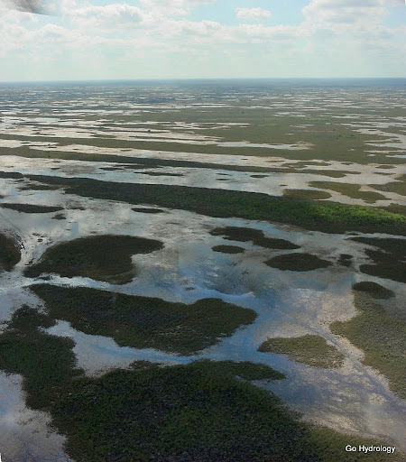
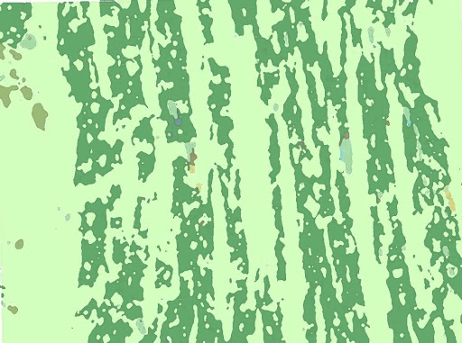
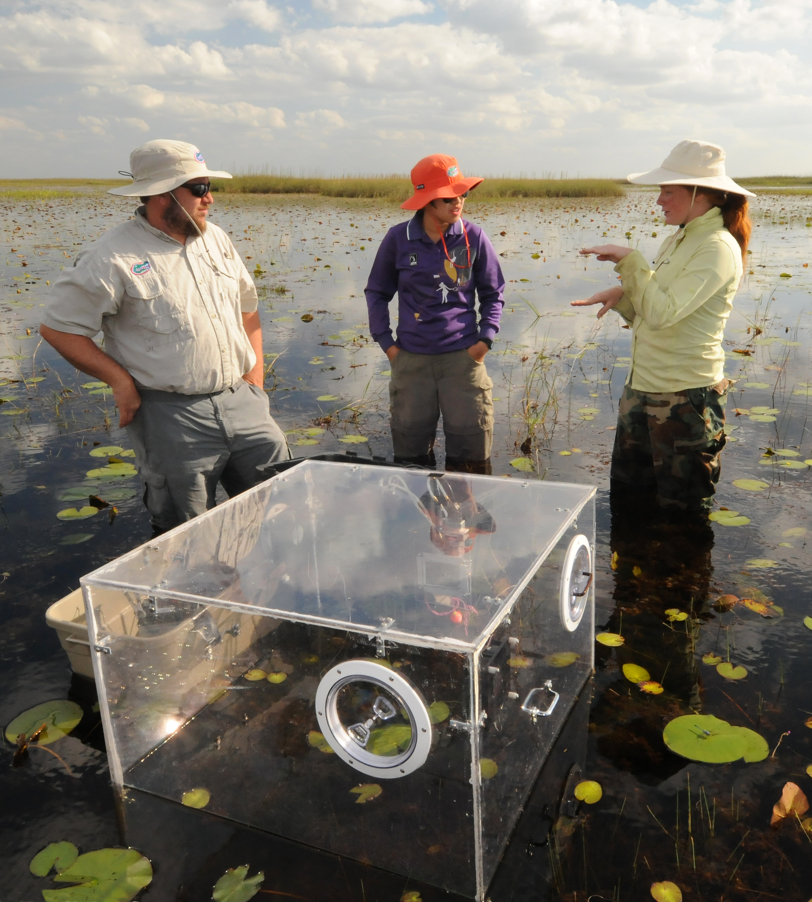

::: {.journey-hero .hero-shell}

::: {.hero-copy .container}

Everglades, Florida, USA · 2009–2015

“A short reflection on how this place changed the way I think.”

:::
::: {.journey-hero}
{.journey-hero-image}

:::
:::

::: {.section .container-fluid .journey-glance}
::: {.row .gx-4 .gy-4}
::: {.col-12 .col-md-6 .col-xl-3}
::: {.feature-card .journey-card}
### Location

Everglades, Florida, USA
:::
:::

::: {.col-12 .col-md-6 .col-xl-3}
::: {.feature-card .journey-card}
### Years

2009–2015
:::
:::

::: {.col-12 .col-md-6 .col-xl-3}
::: {.feature-card .journey-card}
### Themes

Scale · Feedback · Complexity
:::
:::

::: {.col-12 .col-md-6 .col-xl-3}
::: {.feature-card .journey-card}
### Related Research

A brief note or citation
:::
:::
:::
:::

::: {.section .container .journey-story}
## The Story

under construction. This story is still being written. Please check back later for updates.
:::

::: {.section .container-fluid .journey-gallery}
::: {.row .gx-4 .gy-4}
::: {.col-12 .col-lg-6}
::: {.gallery-card}

 Ridge and Slough ecosystem.

:::
:::

::: {.col-12 .col-lg-6}
::: {.gallery-card}

Aerial view of the Everglades ridge and slough pattern.

:::
:::

::: {.col-12 .col-lg-6}
::: {.gallery-card}

Vector map of the Everglades ridge and slough mosaic.

:::

::: {.gallery-card}

Ecohydrology lab members conducting field work in the Everglades.

:::

:::
:::

::: {.section .journey-thinking}
::: {.container}
## Thinking Across Scales

This is the signature section. Summarize how this place changed your understanding of systems, scale, feedback, or complexity. Keep it clear, concise, and slightly more distilled than the main narrative.
:::
:::

::: {.section .container .journey-essays}
## Related Essays

::: {.row .gx-4 .gy-4}
::: {.col-12 .col-md-4}
::: {.feature-card .essay-card}
### Essay One

A short note on how this idea connects to another piece of writing.

[Read more →](#)
:::
:::

::: {.col-12 .col-md-4}
::: {.feature-card .essay-card}
### Essay Two

A short note on how this idea connects to another piece of writing.

[Read more →](#)
:::
:::

::: {.col-12 .col-md-4}
::: {.feature-card .essay-card}
### Essay Three

A short note on how this idea connects to another piece of writing.

[Read more →](#)
:::
:::
:::
:::
