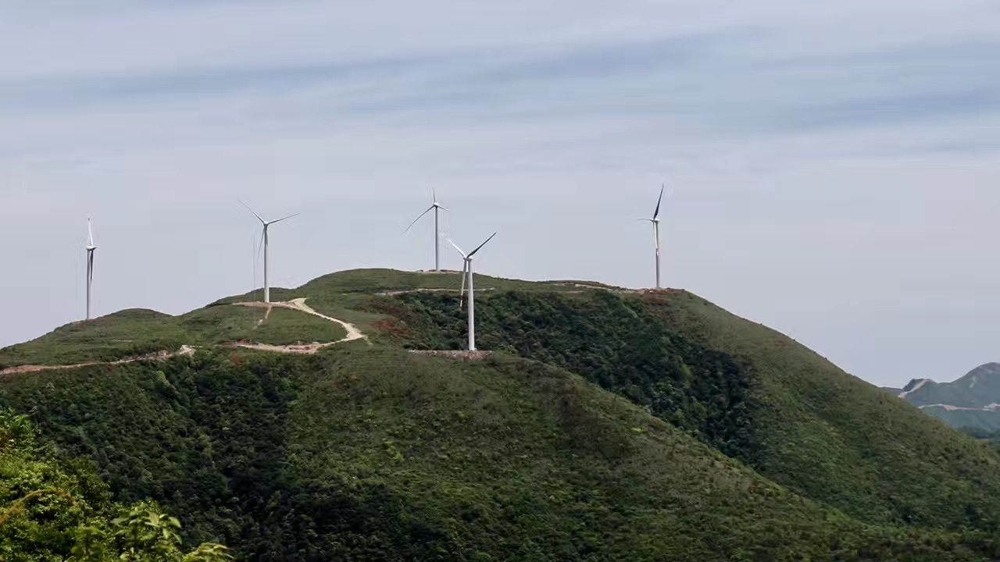
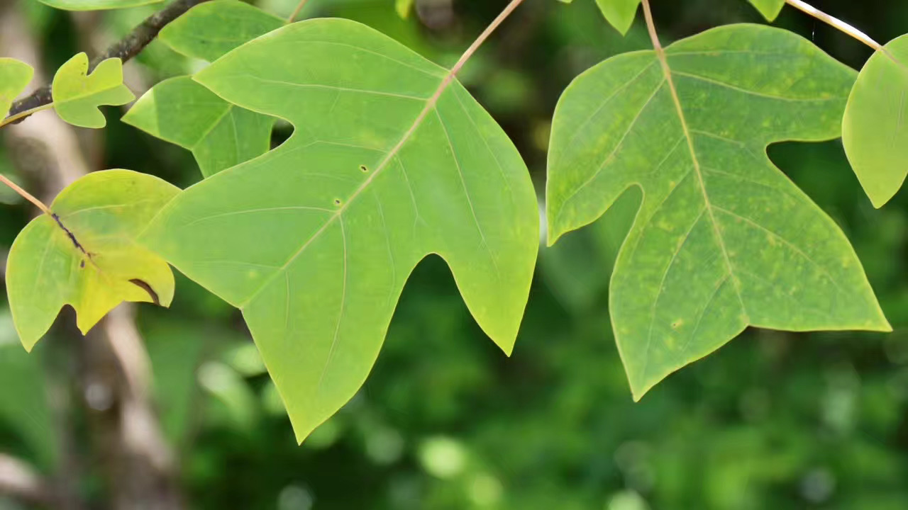

::: {.journey-page}

::: {.journey-hero}

{.journey-hero-image}

:::

---

::: {.journey-story}

It had survived the ice ages of the Quaternary, only to fall beneath the steel teeth of an excavator.

A stand of wild Chinese tulip trees (Liriodendron chinense), an ancient magnolia lineage and a nationally protected species in China, had been cleared to make way for a road leading to a wind farm. Nearby, another protected species, Magnolia officinalis var. biloba, faced an uncertain future.
{.journey-figure}
At first glance, the question seemed obvious: should we save the road or save the trees?

But standing there, I realized that was the wrong question.

Was renewable energy always sustainable? Not necessarily.

Was this simply a conflict between economic development and environmental protection? I no longer believed that either.

Something deeper was unfolding beneath the surface.

I arrived at the site in a vehicle provided by the state-owned wind power company itself.

They were proud of the road we were driving on—it had been built by their company.

As an investigator, however, I could not ignore the irony.

The people leading the investigation were also the people being investigated.

Every destination depended on their guidance. Every conversation happened on their terms.

Long before I reached the forest, I had already begun wondering whether independent observation was even possible.

During every break, I wandered over to talk with the construction workers.

I never saw them as "ordinary laborers."

If anything, they were the anonymous builders carrying the weight of the country's ambitions on their shoulders.

I photographed them as they assembled turbines against the mountains.

One worker smiled when I promised to send him the photos so he could show his family.

For a moment, I wondered why he had never taken these pictures himself.

Then the answer came quietly.

By the end of the day, work had already consumed everything.

Survival leaves little room for poetry.

:::

:::

